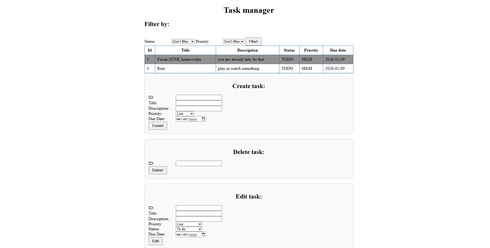
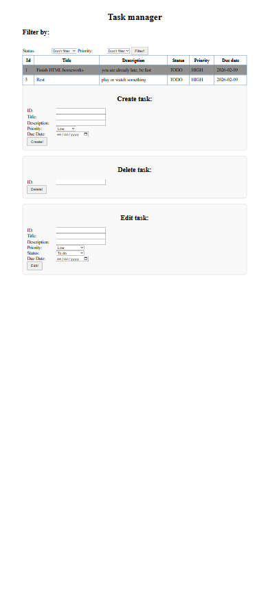

# Task Management System

## Project Description
A simple full-stack web application for managing tasks.
The frontend communicates with the backend through REST API calls using JavaScript `fetch`.

This project was developed as part of a college course and uploaded as a portfolio project.

The system allows users to:
- Create tasks
- View tasks
- Edit tasks
- Delete tasks
- Filter tasks by **status** and **priority**

Each task includes a title, description, priority, status, and due date.  
New tasks are created with a default status of **TODO**.

## Screenshots

### Desktop View



### Mobile View



## Task Enums

### Status
- TODO
- IN_PROGRESS
- DONE

### Priority
- LOW
- MEDIUM
- HIGH

## Technologies
- **Frontend:** HTML / CSS / JavaScript
- **Backend:** Java / Spring Boot
- **Database:** PostgreSQL

## Architecture
The project follows a **3-layer architecture**:

- **Presentation Layer:** HTML/CSS/JavaScript frontend
- **Business Logic Layer:** Spring Boot services and controllers
- **Data Access Layer:** JPA repository with PostgreSQL

## How to Run
1. Start PostgreSQL.
2. Configure the database connection in  
   `src/main/resources/application.properties`
3. Run the Spring Boot application.
4. Set your database password as an environment variable:

   ```bash
   DB_PASSWORD=your_password
5. Open the frontend in your browser:
   
    ```text
   http://localhost:8080/frontend/index.html
  If your application is configured to use another port, replace `8080` with that port.

## API Endpoints
- `GET /tasks` — Retrieve all tasks
- `POST /tasks` — Create a new task
- `PUT /tasks/{id}` — Update an existing task
- `DELETE /tasks/{id}` — Delete a task
